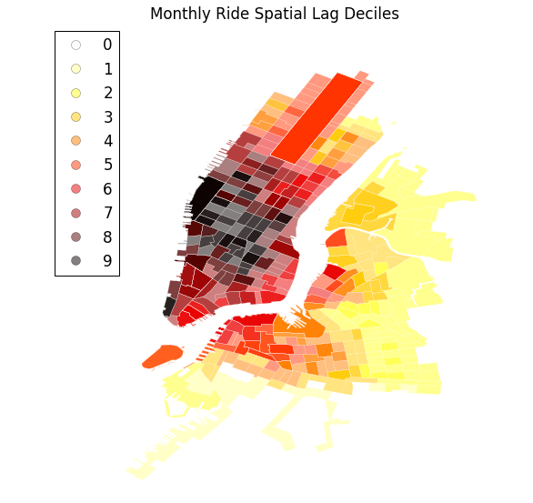
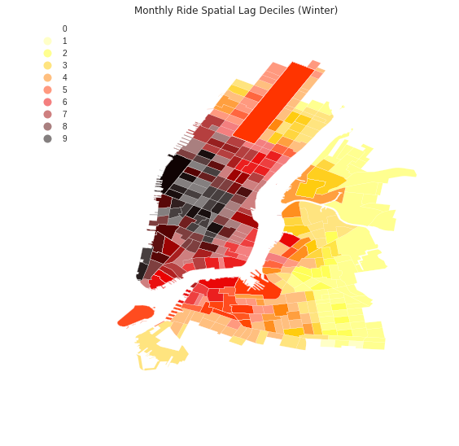

This notebook includes an exploratory spatial data analysis of CitiBike rides. I identify hot and cold spots of ridership based on
their correlation with neighboring stations. The analysis is repeated for the winter and summer months separately.

  

