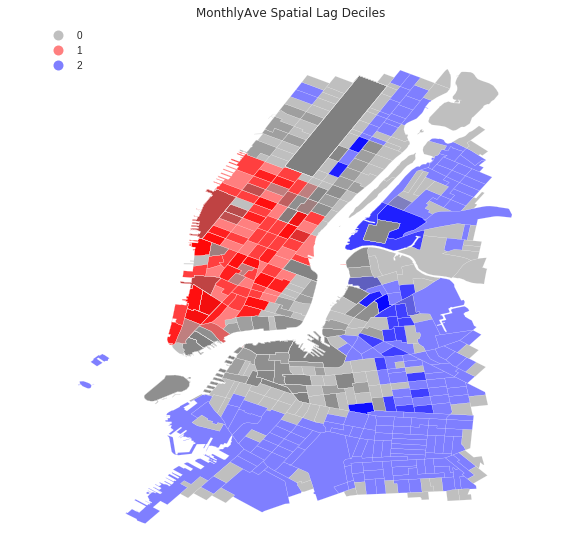
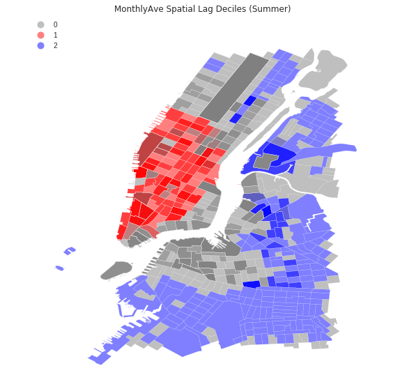

This notebook includes an exploratory spatial data analysis of CitiBike rides. I identify hot and cold spots of ridership based on
their correlation with neighboring stations. The analysis is repeated for the winter and summer months separately.

The following figures show the hot (red) and cold (blue) spots of CitiBike ridership in NYC, for (i) the whole range of data, (ii) the summer months, and (iii) the winter months.

  

What we observe from the figures above, is that in all cases the hot spots are in the area of Manhattan. This makes perfect sense, since
CitiBike is supposed to serve mostly certain regions of Manhattan. Cold spots can be located in areas of the city where there are no 
CitiBike stations at all. 

We notice no different spatial correlation pattern in winter or summer, making the results of the analysis more robust to seasonal change.

