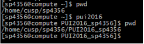

# Assignement 1

spapadopoulos forks the repository of: 1) dfay88/gittest_dfay, and 2) as10724/letsstart  
There is conflict on the first merge, but second is successful  

# Assignment 2

SSH to CUSP gateway server and then to compute  
Create environment variable PI2016 and alias pui2016  
Run commands described in homework and take screenshots  
Create new repository named "PUI2016_sp4356"  
Clone it in local machine  
Add screenshots in the local folder 
Modify README.md file and add screenshots asked  
Commit and push on Github  

