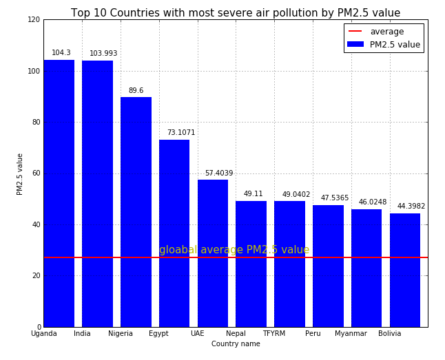

The information is delivered efficiently and the graph is easy to interpret! The y-axis range starts from zero, giving an objective visualization of the difference in quantities, as well as their deviation from the global average. 

Nevertheless, a caption would be very helpful to help readers easily understand the purpose of the plot and summarize the variables depicted. 

Also, it could potentially include a brief description of PM2.5, a rather technical term and also include the time horizon of the data. 

Presenting the global average is a very useful information. The label of the average would look much better on the label box (top right) rather than on top of the line. 

Also, the label box doesn’t provide any new information right now, so it could be easily omitted. Additionally, I would change the value on top of each bar with the percentage deviation from the mean, to give another piece of useful information. 
The absolute value of PM2.5 can be approximately inferred from the y-axis values. 

Finally, the x and y-axis labels could be a bit larger (something like the title) and the country labels could be a bit more centered to each bar. :)
